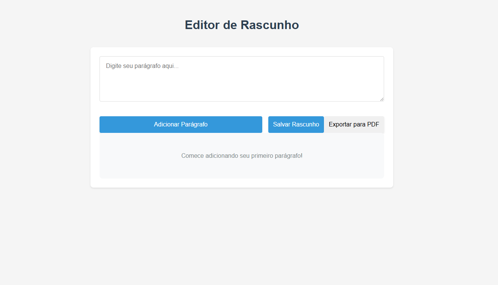

# Editor de Redação Repertório Enem

Uma aplicação React para auxiliar estudantes na criação de redações, com funcionalidades de adição de parágrafos, salvamento de rascunhos e exportação para PDF.

 <!-- Adicione um print da aplicação aqui -->

## Funcionalidades

- **Adicionar Parágrafos**: Digite e adicione parágrafos ao seu rascunho.
- **Editar e Excluir**: Edite ou exclua parágrafos já adicionados.
- **Salvar Rascunho**: Simule o salvamento do rascunho (sem persistência em banco de dados).
- **Exportar para PDF**: Gere um PDF da redação com formatação adequada (recuo de parágrafo e texto justificado).
- **Responsivo**: Funciona bem em dispositivos móveis e desktops.

## Como Executar o Projeto

Siga os passos abaixo para rodar o projeto localmente.

### Pré-requisitos

- [Node.js](https://nodejs.org/) (v16 ou superior)
- [Git](https://git-scm.com/) (opcional, para clonar o repositório)

### Passo a Passo

1. **Clone o repositório** (ou baixe o código fonte):
   ```bash
   git clone https://github.com/Carrielzada/repertorio.git
   cd repertorio

2. **Instale as dependências:**
     ```bash
     npm install
  
3. **Inicie a Aplicação:**
     ```bash
     npm start
4. **Acesse a Aplicação:**
     ```bash
     npm abra o navegador e acesse: http://localhost:3000

4. **Explore as funcionalidades**
- Adicione parágrafos.
- Edite ou exclua parágrafos.
- Salve o rascunho.
- Exporte a redação para PDF.

## Dependências
O projeto utiliza as seguintes dependências principais:
- React: Biblioteca para construção da interface.
- jsPDF: Biblioteca para gerar PDFs.
- CSS: Estilização da aplicação.

Para instalar todas as dependências automaticamente, basta rodar:
```bash
npm install
```
## Estrutura do Projeto 
```
repertorio/
├── public/                  # Arquivos estáticos (HTML, imagens)
├── src/                     # Código fonte da aplicação
│   ├── components/          # Componentes React
│   │   ├── DraftEditor.js   # Editor de redação
│   │   ├── Paragraph.js     # Componente de parágrafo
│   │   └── SaveButtons.js   # Botões de salvar e exportar
│   ├── App.js               # Componente principal
│   ├── index.js             # Ponto de entrada da aplicação
│   └── styles.css           # Estilos globais
├── package.json             # Dependências e scripts
└── README.md                # Documentação do projeto
```
## Licença
Este projeto está licenciado sob a licença MIT. Veja o [arquivo LICENSE](https://github.com/Carrielzada/repertorio/blob/main/LICENSE) para mais detalhes.

## Contato
Se tiver dúvidas ou sugestões, entre em contato:
- Nome: [Vitor Medeiros Carriel](https://www.linkedin.com/in/vitorcarriel/)
- E-mail: [carrielcontato@gmail.com](mailto:carrielcontato@gmail.com)
- GitHub: [Carrielzada](https://github.com/Carrielzada)
